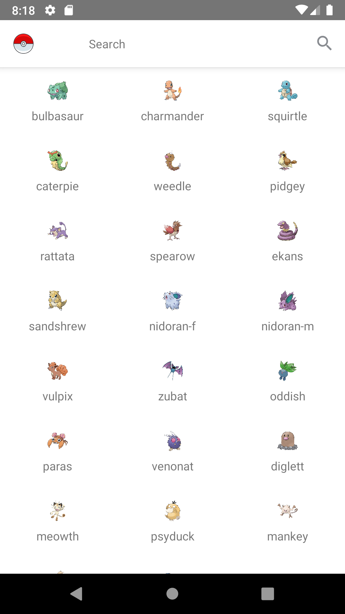
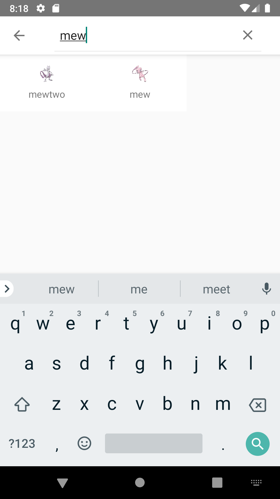
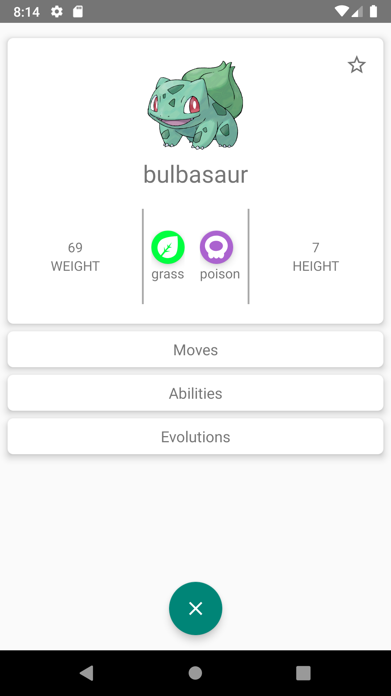
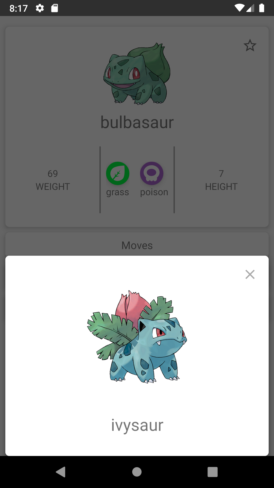

# Pokedex
Esta aplicación lista nombre y imagen de los primeros 151 pokemones, 
al seleccionar uno puedes revisar su detalle 

- Tipo
- Evolución
- Ataques
- Habilidades


### Clone
- Clonar el repositorio usando https://github.com/mau-vargas/pokemon.git 
- tag version/1.0.0

### dependencias utilizadas

```Librerías utilizada
Dagger
Room
Lifecycle
ViewModels
LiveData
Navigation
ViewBinding
Coroutines
Retrofit
Picasso
Unit Tests
Mockito
Jacoco

#Arquitectura
Clean Arquitecture
MVVM

#Lenguaje
Kotlin
```

###  Screenshots







